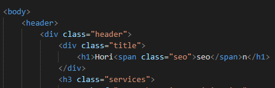
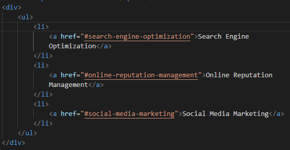
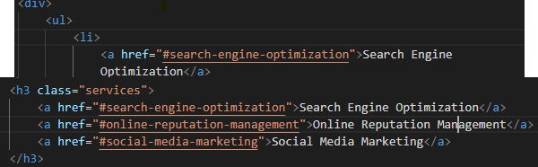
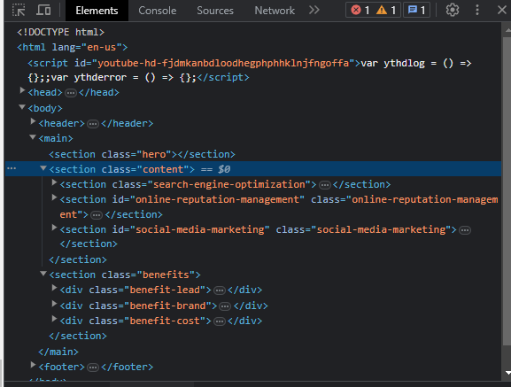

# Project Horiseon

## Code Refactor Example
Changed 
 headers to section to represent different sections of the web page.

Changed h1 to class "title" to define h1 as separate while making adjustments in CSS. 

Changed h3 div to a class called "Services". Deleted ul/li lines because they were preventing h3 headers to align horizontally.

Changed CSS to address new classes: Title and Service.

Added alt-accessibility.

## Usage
To use this guide, review the notation of the Code Refactor Examples, then reference the images. 

To navigate the Horiseon browser, right click the browser, then click "Inspect".
This will create a terminal for you to use as a guide. Click the "Elements" tab at top, then follow the section path shown below.

By hovering over the "Sections", you can see each element of the code being highlighted. To access alt-accessibility descriptions, click the arrows of each "Section" and you will see the alt-accesibility descriptions at the end of  lines. 

## Learning Points
- Sections are important to properly divide the headers of your HTML document. Not only does it provide a framework for your code, but when "Inspected" in browser, it's core for navigation.
- I learned that ul/li lists will prevent a css <inline-block> from putting elements in-line.
- Creating classes is core for organizing and identifying your elements in HTML and CSS. 
- Adding alt-accessibility for images is important for being inclusive towards visitors, as well as meticulous with your code.

## Author Info

[Linkedin] https://linkedin.com/lam-aaron2
[Github] https://github.com/alam2tg/

## Credits

Tutorials

## License
MIT License

Copyright (c) 2023 Aaron

Permission is hereby granted, free of charge, to any person obtaining a copy
of this software and associated documentation files (the "Software"), to deal
in the Software without restriction, including without limitation the rights
to use, copy, modify, merge, publish, distribute, sublicense, and/or sell
copies of the Software, and to permit persons to whom the Software is
furnished to do so, subject to the following conditions:

The above copyright notice and this permission notice shall be included in all
copies or substantial portions of the Software.

THE SOFTWARE IS PROVIDED "AS IS", WITHOUT WARRANTY OF ANY KIND, EXPRESS OR
IMPLIED, INCLUDING BUT NOT LIMITED TO THE WARRANTIES OF MERCHANTABILITY,
FITNESS FOR A PARTICULAR PURPOSE AND NONINFRINGEMENT. IN NO EVENT SHALL THE
AUTHORS OR COPYRIGHT HOLDERS BE LIABLE FOR ANY CLAIM, DAMAGES OR OTHER
LIABILITY, WHETHER IN AN ACTION OF CONTRACT, TORT OR OTHERWISE, ARISING FROM,
OUT OF OR IN CONNECTION WITH THE SOFTWARE OR THE USE OR OTHER DEALINGS IN THE
SOFTWARE.